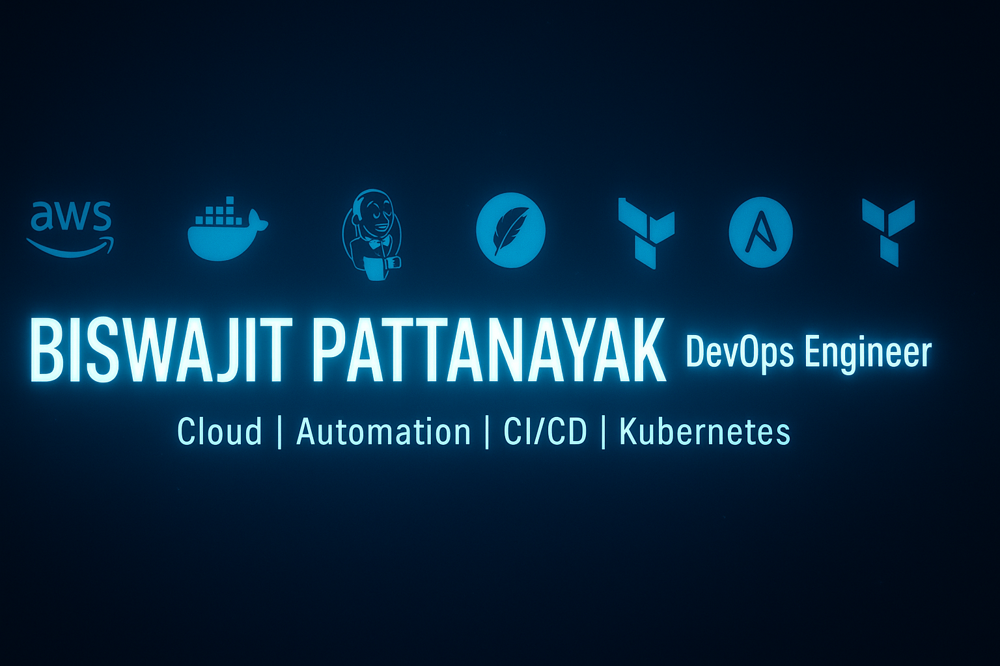
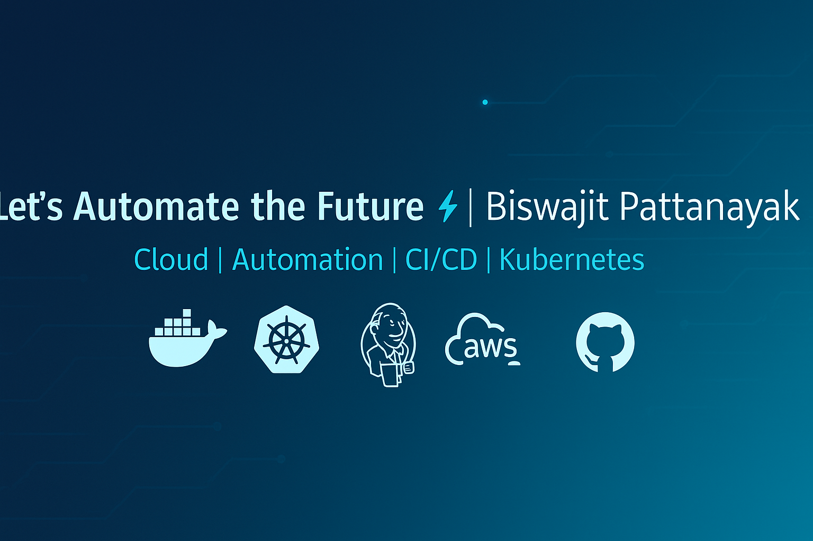

<!-- Futuristic Header -->

  

<!-- Typing Animation -->

  

<h3 align="center">⚡ Cloud & DevOps Engineer | 3+ Years Experience | AWS · Azure · GCP · Kubernetes</h3>

---

## 👨‍💻 About Me
- 🔭 DevOps Engineer with **3+ years of experience** building CI/CD pipelines, containerized applications, and cloud-native infrastructure
- ☁️ Work across **AWS, Azure, and GCP**, managing Kubernetes clusters (**EKS, AKS, GKE**) with Helm for production-grade deployments
- 🏗️ Standardize multi-cloud environments using **Terraform & Ansible** (Infrastructure as Code)
- 📉 Reduced deployment time by **40%** through blue-green and zero-downtime deployment strategies
- 📊 Build monitoring & observability pipelines with **Prometheus, Grafana, ELK Stack, CloudWatch** to improve MTTR
- 🤝 Open to collaborating on DevOps, Cloud Infrastructure, and Automation projects

---

## 🛠️ Tech Stack

### 🚀 Cloud & DevOps

  
  
  
  
  
  
  
  
  
  

### 📊 Monitoring & Tools

  
  
  
  
  
  
  
  

### ⚙️ Scripting

  
  
  

---

## 💼 Experience

**DevOps Engineer — Signovate Technologies Pvt. Ltd** · *June 2024 – Present*
- Design and maintain end-to-end CI/CD pipelines using Jenkins (Groovy-based Jenkinsfiles), Maven, and GitHub
- Automate infrastructure provisioning across AWS & Azure using Terraform and Ansible
- Deploy and orchestrate containerized microservices with Docker, Kubernetes, and Helm
- Implement blue-green deployments, cutting deployment time by **40%**

**DevOps Engineer — Jio Platforms Limited** · *Sep 2023 – May 2024 (Remote)*
- Maintained Jenkins CI/CD pipelines for microservices-based applications
- Supported AWS EKS deployments via Helm; monitored infra health with Prometheus & Grafana
- Provisioned AWS infrastructure (EC2, VPC, S3) using Terraform for staging environments

---

## 🚀 Featured Projects

📌 **CLEAR 2.0 — OTT Platform** (Live TV & On-Demand Content)
`Jenkins` `Groovy` `Docker` `Kubernetes (GKE)` `Terraform` `Ansible` `AWS/GCP/Azure`
- Owned end-to-end CI/CD automation; reduced deployment time by 40%
- Standardized IaC provisioning across three clouds, eliminating configuration drift
- Implemented blue-green deployments for zero-downtime releases

📌 **E-Commerce Omni-Channel Retail System**
`Docker` `Kubernetes (AKS)` `Terraform` `Jenkins` `Helm` `Prometheus` `Grafana`
- Engineered auto-scaling (HPA on AKS) to reliably support 3x seasonal traffic surges
- Built Jenkins + Helm pipelines to standardize deployments across environments
- Set up Prometheus/Grafana monitoring to reduce MTTR

---

## 🏆 Key Achievements
- ⚡ Reduced deployment time by **40%** via blue-green/zero-downtime strategies
- 🌐 Standardized IaC across **AWS, Azure, GCP** using Terraform & Ansible
- 📈 Engineered auto-scaling infra to support **3x traffic surges** with zero manual intervention
- 🔍 Improved observability and MTTR with Prometheus & Grafana across production environments

---

## 📊 GitHub Stats

  
  

---

## 🌐 Connect With Me

  
  

---

<!-- Futuristic Footer -->

  

✨ _"Automating today for a smarter tomorrow."_ ✨
