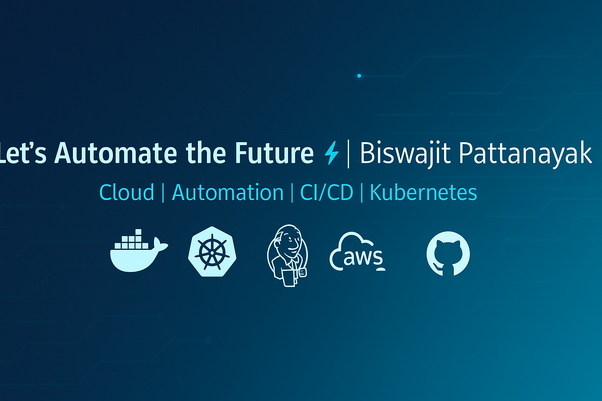

<!-- Futuristic Header -->

  

<!-- Typing Animation -->

  

<h3 align="center">⚡ Building the Future of Cloud & DevOps | Biswajit Pattanayak</h3>

---

## 👨‍💻 About Me  
- 🌱 Currently exploring **CI/CD, Docker, Kubernetes, and AWS**  
- 🔧 Interested in **Infrastructure as Code (Terraform, Ansible)**  
- 📚 Passionate about **automation, scalability, and cloud-native apps**  
- 🤝 Open to collaborating on **DevOps, Cloud, and Open Source projects**  
- 🎯 Goal: Build **secure, futuristic, and automated systems**  

---

## 🛠️ Tech Stack  

### 🚀 DevOps & Cloud Tools  

  
  
  
  
  
  
  
  
  
  
  
  

  

### ⚙️ Programming & Scripting  

  
  

  

---

## 🚀 Featured Projects  

📌 **Two-Tier Flask + MySQL Application with Docker**  
🔹 Containerized a web app and database using Docker  
🔹 Setup custom network for communication  
🔹 Automated deployment with `docker-compose`  

📌 **CI/CD Pipeline with Jenkins + GitHub**  
🔹 Configured Jenkins pipeline for automated build & deploy  
🔹 Integrated with GitHub Webhooks  
🔹 Added security & quality checks (Trivy, SonarQube)  

📌 **AWS Deployment**  
🔹 Deployed app on **EC2** with proper security groups  
🔹 Used **S3 & CloudFront** for static content  
🔹 Automated Infra setup using Terraform  

---

## 📈 Learning Roadmap  

🟢 **Currently Learning**  
- CI/CD with Jenkins & GitHub Actions  
- Docker & Kubernetes for container orchestration  
- AWS services (EC2, S3, IAM, RDS)  

🟡 **Next Goals**  
- Master **Terraform & Ansible**  
- Monitoring & Logging (**Prometheus, Grafana, ELK**)  
- GKE (Google Kubernetes Engine) advanced deployments  

🔵 **Future Goals**  
- Site Reliability Engineering (SRE) practices  
- Security in DevOps (DevSecOps, Trivy, Aqua)  
- Multi-cloud (AWS, GCP, Azure) expertise  

---

## 📊 GitHub Stats  

  
  

  

---

## 🌐 Connect With Me  

  
  

  

---

<!-- Futuristic Footer -->

  

✨ _“Automating today for a smarter tomorrow.”_ ✨  
